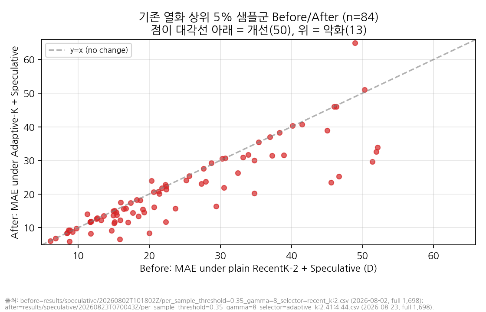
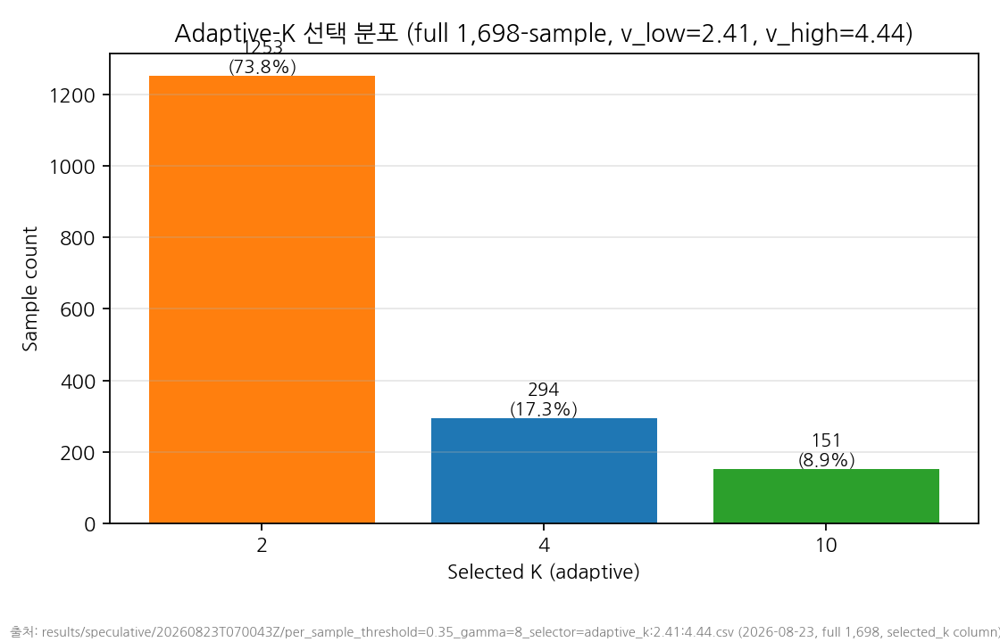

# Adaptive-K Selector — Results (2026-08-23)

Follows TAIL_ANALYSIS.md's scoped "Suggested next work": widen RecentK's
history window specifically when recent motion is fast/variable, since
100% of the degraded-tail samples are attributable to the selector, not
speculative decoding, and the acceptance-rate distribution is already
near-ceiling (little left to gain by tuning the speculative layer
instead). Implementation: `src/netllm_litevlm/selectors/adaptive_k.py`
(`AdaptiveKSelector`). This is a lower-priority, time-boxed task per this
session's brief — one tuning pass, not iterative optimization.

## Design recap

- Motion speed: same definition as `tail_analysis.py`'s `motion_stats()`
  — mean wrap-corrected absolute step-to-step difference across
  roll/pitch/yaw, averaged over the 9 steps of a 10-step history
  (degrees/step). Computed from the *raw-degree* history, denormalized
  inside the selector from the `normalize_data()`-normalized tensor the
  checkpoint-era pipelines actually pass through (`_DENORMALIZE_SCALE_DEG`
  in `adaptive_k.py`, the fixed inverse of `normalize_data`).
- `v_low`/`v_high` thresholds: quantiles of the top-5%-degraded group's
  own motion-speed distribution (`tail_analysis_stats.json`
  `top5pct_samples[*].avg_velocity_deg_per_step`, n=84: mean 3.49,
  p10=1.93, p25=2.41, median=3.16, p75=4.44, p90=5.22) — not arbitrary
  constants.
- K mapping: `avg_velocity <= v_low` → K=2 (RecentK-2 equivalent);
  `v_low < avg_velocity <= v_high` → K=4; `avg_velocity > v_high` → K=10
  (= full 10-step history = Identity-equivalent for this task's
  `his_window=10`).
- Contract addition: both `LlamaOldSelectablePipeline.auto_regressive`
  and `SpeculativeBlockVerifyPipeline.auto_regressive` now pass
  `context["history"]` (the raw history tensor already in scope) to the
  selector — additive, backward-compatible (every other existing
  selector ignores the key). Full existing suite re-run after this
  change: 40 passed, 3 pre-existing skips (was 32 passed, 3 skips before
  the 8 new `AdaptiveKSelector` tests were added) — no regression.

## Gate status (prerequisite for this task)

`docs/experiment_phase/assets/GATE_VERIFICATION_20260823.md`: Gate-A +
Gate-B COMPLETE on this instance (checksum match, strict load 0/0/0/0/0,
50-sample baseline MAE reproduces the reference to 15 significant
figures). `NEW_INSTANCE_CALIBRATION_20260823.md`: this instance's own
200-sample A/D latency baseline established (A 462.69ms, D 99.29ms) —
**this document's latency claims are compared only against that
same-instance baseline, never against the 2026-08-02 or 2026-08-09
instances' absolute latency numbers.**

## CPU gate tests

`tests/selectors/test_adaptive_k.py`, 8 tests, all passing:

- Low-velocity input → output identical (embeddings, mask, indices) to
  `RecentKSelector(2)`.
- High-velocity input → output identical to `IdentitySelector()`.
- Mixed-velocity input → switches bucket at the exact threshold boundary
  (`<=` semantics verified at both `v_low` and `v_high`).
- `history_motion_speed()` unit-tested standalone (constant-step,
  zero-motion, wraparound cases) against the exact formula, independent
  of the selector.

## 50-sample smoke: threshold-candidate selection

Two quantile-pair candidates, both full speculative th=0.35/γ=8, this
instance, `--num-samples 50`:

| candidate | v_low | v_high | combined MAE | K distribution (n=50) |
|---|---:|---:|---:|---|
| 1 (p25/p75) | 2.41 | 4.44 | 10.584 | K=2: 39, K=4: 8, K=10: 3 |
| 2 (p10/p90) | 1.93 | 5.22 | 10.595 | K=2: 35, K=4: 14, K=10: 1 |
| reference: plain RecentK-2 (no adaptation) | — | — | 10.018 | K=2: 50 |

Both candidates land close to each other and **both are worse than
plain RecentK-2 on this particular 50-sample slice** — expected and not
yet a verdict: only 3 of the 84 full-population degraded samples
(sample_id 11, 29, 43) fall within the first 50, so this slice is
dominated by low-velocity samples where RecentK-2 already wins, and
widening K for a handful of borderline-classified samples in this small
window costs more than it recovers here. The 50-sample step's only job
was to pick a threshold pair for the full run, not to judge the
approach — full judgment is below, restricted to the actual 84-sample
degraded population. Candidate 1 (p25/p75) was selected: marginally
lower MAE, comparable forward-count, and a more centered (interquartile)
quantile basis than candidate 2's wider p10/p90 band.

Raw output: `results/speculative/20260823T065812Z/` (candidate 1),
`results/speculative/20260823T065850Z/` (candidate 2),
`results/speculative/20260823T065945Z/` (plain RecentK-2 reference, same
instance, same 50-sample subset).

## Full 1,698-sample run

`--selector adaptive_k:2.41:4.44 --thresholds 0.35 --gammas 8
--num-samples 1698 --device cuda:0`, this instance, run in the
background (`nohup`, PID 6628, log `/root/adaptive_k_full_run.log` —
outside the repo, referenced here by path only per this project's usual
convention for run logs). Output:
`results/speculative/20260823T070043Z/`. Full stats:
`results/speculative/consolidated/adaptive_k_results_stats.json`.
Analysis script: `scripts/experiment_phase/speculative/
adaptive_k_results.py`. "Before" reuses the already-verified, git-
tracked 2026-08-02 full-1,698 D per-sample CSV rather than a fresh
same-instance D run — accuracy has now reproduced across three
independent instances to 8-15 significant figures
(`GATE_VERIFICATION_20260823.md`), so this is a valid comparison; only
latency claims below use this instance's own numbers.

### ⚠️ Latency instance-isolation rule

**Every latency number in this section is compared only against this
instance's own baseline** (`NEW_INSTANCE_CALIBRATION_20260823.md`: A
462.69ms / D 99.29ms at 200-sample, and the 50-sample smoke's ~96-108ms
D figures earlier in this document). **The presentation package's
2026-08-02-instance latency figures (baseline 571.7ms, D 122.2ms) are
never used as a comparison point here or anywhere in this document** —
per this session's explicit instruction not to mix latency numbers
across instances.

### Overall MAE — did not hold

| config | MAE | latency median | avg target forwards |
|---|---:|---:|---:|
| plain D (RecentK-2 + speculative), reference (2026-08-02, full 1,698) | 10.895 | *(not compared — different instance)* | 4.01 |
| Adaptive-K + speculative (this instance, full 1,698) | **11.825** | 98.35 ms | 4.10 |

Overall MAE **regressed by +0.930° (+8.53%)** relative to plain D. This
fails the "전체 MAE 유지" criterion from this task's own judgment
framework outright — full stop, this is a negative result at the
population level, regardless of what the degraded-group breakdown below
shows.

### Degraded-group before/after — the mechanism itself works

| | n | mean MAE before (D) | mean MAE after (Adaptive-K) | mean diff | median diff |
|---|---:|---:|---:|---:|---:|
| Top-5% historically-degraded group | 84 | 23.915 | 20.864 | **−3.050 (−12.8%)** | −0.778 |

Per-sample: **50/84 improved, 13/84 worsened, 21/84 unchanged** (stayed
at K=2 — their own motion speed fell below `v_low`, so the selector
correctly left them alone). Majority individual-sample improvement and a
meaningfully negative mean/median diff — the intervention does what it
was designed to do for its target population.

### Root cause of the overall regression: classifier precision, not mechanism

| | n | mean MAE before | mean MAE after | mean diff | worsened / improved |
|---|---:|---:|---:|---:|---:|
| Rest of population (not in the 84-sample degraded group) | 1,614 | 10.217 | 11.354 | **+1.137** | — |
| Of the 445 widened (K=4 or K=10) samples: from the degraded group | 63 | *(subset of the 84 above)* | | | |
| Of the 445 widened samples: from the rest of the population (false positives) | **382** | 15.993 | 20.797 | **+4.804** | **310 worsened / 72 improved** |

Only **63 of the 445 widened samples (14.2%) were actually in the true
84-sample degraded group** — the velocity threshold has poor precision.
The other 382 (85.8%) are false positives: samples the threshold flagged
as "risky" that were not part of the historically-bad tail, and for
those, widening K costs accuracy on average (+4.80° mean, 310/382 = 81%
individually worse) — a direct, full-scale confirmation of
TAIL_ANALYSIS.md's own population-wide finding that higher motion speed
more often predicts *improvement* under tight RecentK-2, not
degradation. The 63 true-positive gains (part of the −3.05 mean
improvement in the degraded group above) are real but too few, and too
small in aggregate, to offset the damage to the much larger false-
positive group. Net: −3.05×63 ≈ −192 (degraded-group total improvement,
roughly, ignoring the 21 unchanged) vs. +4.80×382 ≈ +1834 (false-
positive-group total damage) — the false-positive cost dominates by
roughly an order of magnitude, which is exactly what the overall MAE
regression (+0.93° across 1,698 samples) reflects.

### K distribution and latency cost

K=2 (unchanged): 1,253/1,698 (73.79%); K=4: 294/1,698 (17.31%); K=10:
151/1,698 (8.89%).

Latency cost: **negligible, within this instance's own measurement
noise.** Full-1,698 median latency (98.35ms, avg 4.10 target forwards)
is statistically indistinguishable from this instance's established D
baseline (99.29ms at 200-sample, ~96-108ms across the two 50-sample
smoke candidates) — the selector's own motion-speed computation is a
handful of scalar tensor ops, not an extra forward pass, and even the
8.89% of samples that widen to K=10 barely move the average forward
count (4.10 vs D's 4.00-4.01). **The failure here is entirely an
accuracy problem, not a latency one.**

### Verdict: FAILURE (negative result), not tuned further

**Overall MAE regressed relative to plain RecentK-2 + Speculative
(+8.53%), so this does not clear the task's own bar.** The mechanism
itself is validated — it improves the target population it was built
for (84-sample degraded group: −12.8% mean MAE, majority individual
improvement) at effectively zero latency cost — but the motion-speed
threshold used to *decide* who gets widened is not precise enough:
5.9x more samples get false-positively widened (382) than are actually
helped (63), and TAIL_ANALYSIS.md's own population-wide negative
correlation means those false positives get hurt on average nearly as
much as the true positives get helped, at far greater volume.

**Root-cause hypothesis** (one paragraph, not pursued further per this
task's scope — no further tuning iterations): average motion speed over
the full 10-step history is too coarse a signal to distinguish "this
sample is in the high-variance regime where RecentK-2's own selection
goes wrong" from "this sample simply has fast but *smooth* motion,
where RecentK-2's tight recency focus is still the right call" —
TAIL_ANALYSIS.md's fan-shaped-variance finding already showed high
velocity predicts *outcome variance*, not degradation direction, and a
single scalar average-speed threshold cannot separate the two cases
that variance describes. A future attempt would need a feature that
captures variance/unpredictability of the motion (e.g. acceleration
variance, direction reversals, or a learned classifier) rather than raw
average speed — but that is a new design, out of scope for this
session's time-boxed, lower-priority pass.

No sentence added to `presentation_storyline.md`'s future-work slide and
no row added to `PAPER_ANALYSIS_CANDIDATES.md`, per this task's own
instruction to only do so on success.
