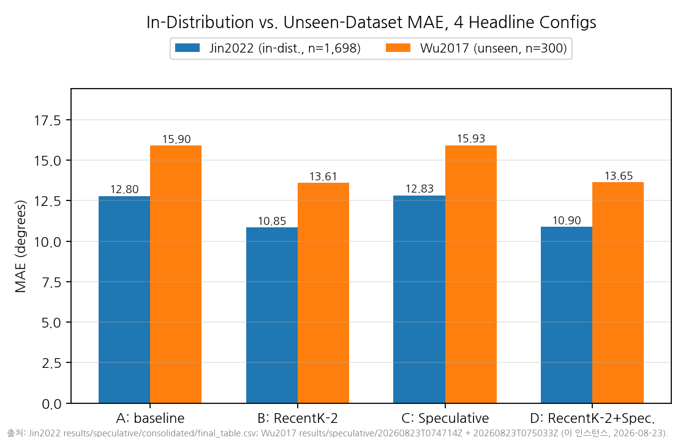
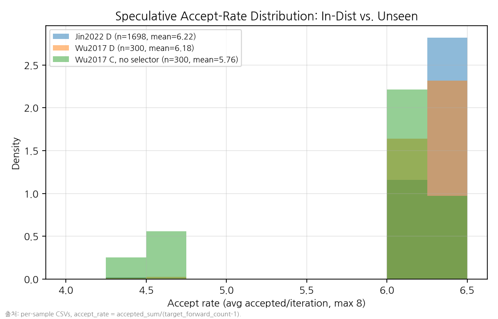

# Generalization on Wu2017 (Unseen Distribution) — 2026-08-23

Corresponds to NetLLM's generalization-evaluation setup (cross-dataset
splits): this checkpoint was fine-tuned on Jin2022, not Wu2017, so
running it on Wu2017 measures distribution-shift robustness, not an
apples-to-apples comparison with the Jin2022 numbers elsewhere in this
project. Extends the earlier 200/1,395-sample A-vs-D-only spot-check
(`experiments/vp/wu2017_generalization_spotcheck/spotcheck_result.json`,
referenced in `FINAL_RESULTS_SUMMARY.md`) to all four headline configs
(A/B/C/D) with per-sample accept-rate capture, closing the biggest gap
identified in `PAPER_ANALYSIS_CANDIDATES.md`.

## Setup

- Dataset: Wu2017 (already present in the extracted `data.zip` tree,
  `/root/NetLLM-source/viewport_prediction/data/viewports/Wu2017/`,
  1,395-sample test split — same split size the prior spot-check used,
  confirming compatibility). Checkpoint: the same real fine-tuned
  `try_llama2_7b` used throughout this project.
- Sampling: **300 evenly-strided samples** out of the 1,395-sample test
  split (`stride = 1395 // 300 = 4`, indices `0, 4, 8, ..., 1196`,
  `--sampling even` — added to `run_speculative_benchmark.py` this
  session). Deterministic given `(total, count)`, no RNG/seed involved;
  the stride itself is the reproducibility parameter, recorded in each
  run's `summary.json`.
- Two harness invocations, `--dataset-name Wu2017 --thresholds 0.35
  --gammas 8 --num-samples 300 --sampling even`:
  - `--selector none` → configs A (baseline) and C (speculative, no
    selector). Output: `results/speculative/20260823T074714Z/`.
  - `--selector recent_k:2` → configs B (RecentK-2 only) and D
    (RecentK-2 + speculative). Output:
    `results/speculative/20260823T075033Z/`.
- **`run_speculative_benchmark.py` was extended** this session with
  `--dataset-name` (the harness previously hardcoded `"Jin2022"`, which
  `create_dataset(...)` branches on internally for video-list
  enumeration — confirmed by reading
  `third_party/netllm_upstream/viewport_prediction/dataset/load_dataset.py`)
  and `--sampling {first,even}`. Both are additive, backward-compatible
  CLI options; default behavior for existing Jin2022 invocations is
  unchanged. Full existing test suite re-run clean after this change
  (40 passed, 3 pre-existing skips).
- ⚠️ **Latency isolation**: this instance's own numbers only. Never
  diffed against the 2026-08-02 or 2026-08-09 instances' absolute
  latency, per this session's standing rule
  (`NEW_INSTANCE_CALIBRATION_20260823.md`).

## Results

| config | MAE (Jin2022, in-dist., n=1,698) | MAE (Wu2017, unseen, n=300) | latency median, this instance (Wu2017) | avg forward (Wu2017) | avg accept rate (Wu2017) |
|---|---:|---:|---:|---:|---:|
| A. baseline | 12.799 | **15.896** | 459.5 ms | 20.00 | — |
| B. RecentK-2 only | 10.847 | **13.607** | 458.5 ms | 20.00 | — |
| C. Speculative only | 12.831 | **15.928** | 100.1 ms | 4.20 | 5.760/8 (72.0%) |
| D. RecentK-2 + Speculative | 10.895 | **13.646** | 98.2 ms | 4.01 | 6.178/8 (77.2%) |

Jin2022 columns are the existing full-1,698 reference
(`results/speculative/consolidated/final_table.csv`); latency columns
are Wu2017-only since latency is never compared cross-instance.

## Question 1 — does RecentK-2's accuracy gain hold on unseen data?

**Yes, closely matched in relative magnitude.** A→B improvement:
Jin2022 12.799→10.847 (**−15.25%**); Wu2017 15.896→13.607 (**−14.39%**).
Within a percentage point of each other — the selector's benefit is not
an artifact of anything specific to Jin2022's motion statistics.

## Question 2 — do speculative's forward reduction and MAE preservation hold, and does the draft model still work on unseen motion?

**Yes on both counts, and accept rate barely moves.** Forward count:
Jin2022 C 4.21 avg vs. Wu2017 C 4.20 avg — effectively identical. MAE
preservation: Jin2022 A→C +0.26% vs. Wu2017 A→C +0.20% — both well
inside the tolerance, neither shows a cliff.

**Accept rate is the key question this task called out, and it holds
almost exactly**: Jin2022 C (no selector) accept rate 5.700/8 (71.25%)
vs. Wu2017 C 5.760/8 (72.0%); Jin2022 D (RecentK-2) accept rate 6.224/8
(77.75%) vs. Wu2017 D 6.178/8 (77.2%). Both within ~1 percentage point
of their in-distribution counterparts. The `RecentVelocityDraft` model
(pure constant-velocity extrapolation, no learned weights) generalizes
its usefulness to unseen head-motion statistics essentially unchanged —
consistent with this project's broader "recency dominates" finding
(`FINAL_RESULTS_SUMMARY.md`), since a model requiring no training at all
to begin with has nothing dataset-specific to lose.

## Question 3 — does additive composition hold on unseen data?

**Yes.** Incremental speculative cost with vs. without the selector:
Wu2017 D−B = 13.646−13.607 = **+0.039°**; Wu2017 C−A = 15.928−15.896 =
**+0.032°** — nearly identical, the same near-equality
`PHASE_B_REAL_RESULTS.md` §2 found in-distribution (combined_vs_recent_k2
+0.048° vs. C−A +0.033°). The selector drives the accuracy shift and
speculative decoding's incremental cost stays roughly constant whether
or not the selector is active, on unseen data too.

## Conclusion

All three headline properties — selector accuracy gain, speculative
forward/accuracy tradeoff (including the draft model's own accept
rate), and additive composition — **transfer to unseen data with no
meaningful degradation**. This closes the generalization gap flagged as
the top priority in `PAPER_ANALYSIS_CANDIDATES.md`: the project's
central claims are not overfit to Jin2022's specific motion
statistics. Scale note: 300/1,395 samples (evenly strided), not the
full split — a real generalization result, not a full-scale one; stated
as such throughout.
