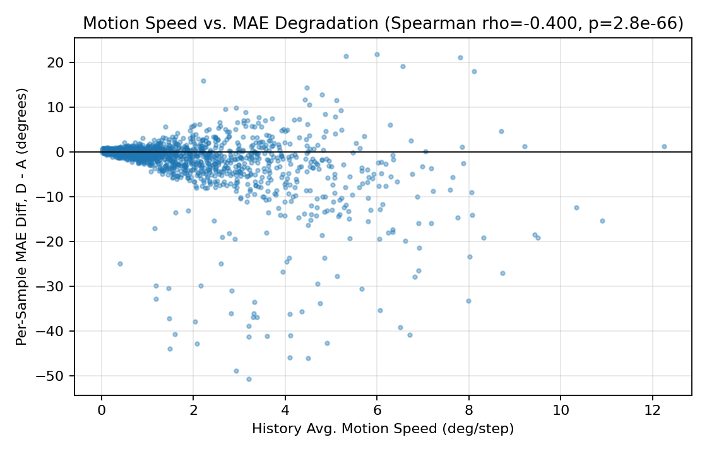

# Tail Analysis — Why 47% of Samples Degrade Under Config D

`PHASE_B_REAL_RESULTS.md` §2 found that config D (RecentK-2 +
speculative) improves aggregate MAE substantially (baseline 12.799 →
10.895) but is not a uniform per-sample win: 47.1% of the 1,698 samples
individually have *higher* MAE than baseline, with a real tail (p99
diff +7.77°). This document identifies which samples, why, and which
component (selector vs. speculative decoding) is responsible.

Script: `scripts/experiment_phase/speculative/tail_analysis.py`. Raw
output: `results/speculative/consolidated/tail_analysis_stats.json`.
History motion speed/acceleration is re-derived directly from the
dataset (deterministic construction, same `create_dataset(...)` call as
every other script this session, so `sample_id` lines up with row order
in the already-produced per-sample CSVs) rather than stored separately.

## Top-5% degraded samples (85 of 1,698)

Concentrated across 6 of the 7 test-split videos (24: 21, 4: 15, 25: 15,
18: 13, 8: 10, 14: 10 — video 30 has none), roughly proportional to each
video's share of the test split rather than dominated by one outlier
video — ruling out a single-video confound as the explanation. Full list
in `tail_analysis_stats.json`; worst 3:

| sample_id | video/user/timestep | diff (D−A) | history motion speed (deg/step) | attribution (diff_B−A / diff_D−B) |
|---|---|---:|---:|---|
| 116 | 4/45/90 | +21.94° | 6.00 | +22.01 / −0.07 |
| 1115 | 24/83/105 | +21.45° | 5.33 | +21.88 / −0.43 |
| 213 | 4/84/75 | +21.17° | 7.81 | +21.18 / −0.01 |

## Correlation analysis (all 1,698 samples, Spearman)

| variable vs. per-sample MAE diff (D−A) | rho | p |
|---|---:|---:|
| history motion speed (deg/step) | **−0.400** | 2.8e-66 |
| history acceleration (deg/step²) | −0.348 | 1.6e-49 |
| speculative accept rate (avg accepted/iteration) | +0.168 | 3.6e-12 |
| target forward count | −0.003 | 0.89 (not significant) |

`target_forward_count` has essentially zero correlation with accuracy
change — forward-count reduction and accuracy are statistically
independent in this data, consistent with the additive-composition
finding in `PHASE_B_REAL_RESULTS.md` §2.

## Hypothesis check: "degradation concentrates in abrupt-motion segments
(inertia assumption breaks down)"

**Partially supported — concentrated in the tail, but not a simple
monotonic population-wide effect.**

- The top-5%-worst group has **2.16x higher mean motion speed** than the
  rest (3.49 vs. 1.62 deg/step), Mann-Whitney U one-sided p=3.0e-24 —
  strong, significant support for "the worst cases concentrate in
  higher-motion segments."
- But the population-wide Spearman correlation is **negative**
  (rho=−0.40): higher motion speed more often correlates with
  *improvement*, not degradation, across the full 1,698 samples. The
  scatter plot shows why — it is not a simple linear trend but a
  **fan-shaped spread**: low-velocity samples cluster tightly near
  diff≈0, while high-velocity samples show much larger dispersion in
  *both* directions (down to −50°, up to +22°). Most high-velocity
  samples benefit substantially from RecentK-2's tighter focus on
  current trend; a minority — the ones landing in the top-5% tail — go
  badly wrong instead.

So the precise claim the hypothesis should be revised to: **high history
motion speed increases the variance of D's outcome relative to baseline,
and the worst-case tail is drawn from that high-variance, high-speed
regime — but high speed alone does not predict degradation; it more
often predicts a large improvement.** "Abrupt motion" is a necessary
condition for the worst outcomes to appear, not a sufficient one for
degradation in general.

## Attribution: selector vs. speculative decoding

For **all 85 of the top-5% degraded samples** (100%), `|diff(B,A)| >=
|diff(D,B)|` — the RecentK-2 selector's own effect dominates the total
degradation; speculative decoding's incremental contribution
(`diff(D,B)`) is small and often slightly *negative* (i.e. speculative
decoding partially offsets the selector's error on these samples, rather
than adding to it — e.g. sample 116: selector alone +22.01°, speculative
on top of it −0.07°). This is the same finding as
`PHASE_B_REAL_RESULTS.md` §2's aggregate paired-diff decomposition,
now confirmed at the individual worst-case level with no exceptions:
**the tail is a RecentK-2 selection phenomenon, not a speculative-
decoding one.**

## Summary (also integrated into `docs/final/FINAL_RESULTS_SUMMARY.md`)

Degradation under config D concentrates in a high-motion-speed,
high-variance regime — the worst 5% of samples average 2.16x the motion
speed of the rest (p=3.0e-24) — but motion speed is not monotonically
bad; most high-motion samples improve. Every one of the top-5% degraded
samples' error is attributable to RecentK-2 selection, not speculative
decoding, which composes additively and often slightly offsets rather
than compounds the selector's error.
