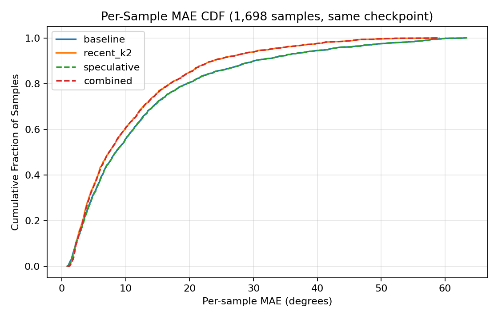

# Phase B — Real-Checkpoint Speculative Decoding Results

**Same-checkpoint controlled comparison.** Every number in this document
comes from the same recovered `try_llama2_7b` checkpoint (strict-loaded,
missing/unexpected keys 0/0/0/0/0 — see
`docs/experiment_phase/assets/ASSET_RECOVERY_VERIFICATION.md`) and the
same recovered Jin2022 test split, on one GPU, in fp16. Only the decoding
strategy (baseline / block verification threshold / selector) changes
between rows. As with the original 7.26 selector benchmark, this is a
controlled comparison, not a claim of matching any external/paper
benchmark protocol.

## 0. Asset and baseline reproduction (prerequisite gates)

- Checkpoint strict load: adapter missing/unexpected/value-mismatch = 0/0/0;
  non-PLM missing/unexpected = 0/0.
- Dataset test split: exactly 1,698 samples (matches the 7.26 report).
- Full 1,698-sample baseline MAE: **12.798559** vs. the 7.26 report's
  12.798525 (diff 0.000034, fp16 noise). Corrected RMSE 27.118723 vs.
  27.118540.

Both gates passed before any speculative or selector number below was
treated as trustworthy.

## 1. Speculative block verification — full 1,698-sample results

Threshold is a normalized (Tanh-bounded, ~[-1,1]-per-channel) L2 distance
between draft and target task-head outputs (see
`docs/experiment_phase/speculative/PHASE_A_DESIGN.md` §3 and
`src/netllm_litevlm/speculative/block_verify.py`'s `acceptance_threshold`
docstring) — not degrees. Calibrated empirically against real draft-vs-
target disagreement (10 samples, 40 steps: median 0.174, most mass
0.01-0.7).

Selected via a 50-sample smoke across 5 thresholds × 3 gammas (+3
boundary-search extras at gamma=8) — full grid in
`results/speculative/20260802T081351Z/` and
`results/speculative/20260802T081802Z/`. All 18 smoke configs stayed
within 0.42% of baseline MAE; gamma=8 dominated latency at every
threshold since forward count was already near its floor.

| config | MAE | vs. baseline | corrected RMSE | latency median | target forward avg | speedup_claim_valid | accuracy_preserved |
|---|---:|---:|---:|---:|---:|---|---|
| baseline | 12.798559 | — | 27.118723 | 571.7 ms | 20.00 | False | True |
| threshold=0.35, gamma=8 | 12.831302 | +0.26% | 27.141736 | 124.4 ms | 4.21 | **True** | True |
| threshold=0.70, gamma=8 | 12.849404 | +0.40% | 27.154655 | 124.0 ms | 4.08 | **True** | True |
| threshold=1.50, gamma=8 | 12.892513 | +0.74% | 27.236853 | 123.5 ms | 4.03 | **True** | True |
| threshold=2.50, gamma=8 | 12.929292 | +1.02% | 27.327807 | 123.6 ms | 4.02 | **True** | True |

**Verdict criteria (defined in code,
`scripts/experiment_phase/speculative/run_speculative_benchmark.py`):**
- `speedup_claim_valid` = target-forward-count reduction AND latency
  reduction, both measured against baseline.
- `accuracy_preserved` = MAE ≤ baseline MAE × 1.05.

All four selected configs satisfy both. This is the first time in this
project's speculative-decoding work that `speedup_claim_valid=True` has
been recorded against the real checkpoint at full scale — earlier
prototypes either always cost the full 20 forwards
(`continuous_draft_verify.py`, see `PHASE_A_DESIGN.md` §2) or ran only
against a randomly-initialized head (`PHASE_B_7B_SMOKE.md`). No general
"speedup" claim is made beyond these measured numbers: latency was
measured on one GPU, one process, fp16, this checkpoint, this dataset —
not benchmarked against other implementations or hardware.

## 2. Selector × Speculative combination — the headline result

**Compatibility gate (prerequisite, tiny CPU model + 5 real-checkpoint
samples).** Before trusting any combined run: traced
`block_verify.py` and confirmed the draft model's velocity extrapolation
always uses the raw `history` argument passed to `auto_regressive()`,
never the selector-reduced embedding sequence — a selector's K has zero
effect on what the draft sees, only on what the target LLM's initial
prefill sees. KV-cache position indexing with a selector-shortened
prefill was checked directly (not just argued from code reading):
`SpeculativeBlockVerifyPipeline` vs `LlamaOldSelectablePipeline`, both
wrapping `RecentKSelector(k)`, match to 1e-5 for k in {4, 6, 10} on a
tiny CPU model (`tests/speculative/test_block_verify.py`). On the real
checkpoint, `RecentKSelector(2)` + `SpeculativeBlockVerifyPipeline`
(threshold=0) matched `RecentKSelector(2)` alone within 0.00146 max abs
diff over 5 samples (under the established 2e-3 fp16 tolerance), forward
count exactly 20 every time. Gate passed.

**Full 1,698-sample ablation**, `--selector recent_k:2`:

| config | MAE | corrected RMSE | latency median | target forward avg |
|---|---:|---:|---:|---:|
| A. baseline | 12.798559 | 27.118723 | 571.7 ms | 20.00 |
| B. RecentK-2 only | 10.846867 | 22.486722 | 623.0 ms | 20.00 |
| C. Speculative only (threshold=0.35, gamma=8) | 12.831302 | 27.141736 | 124.4 ms | 4.21 |
| **D. RecentK-2 + Speculative (threshold=0.35, gamma=8)** | **10.895102** | 22.547304 | **122.2 ms** | 4.01 |
| D'. RecentK-2 + Speculative (threshold=0.70, gamma=8) | 10.902756 | 22.580308 | 121.9 ms | 4.00 |

B reproduces the 7.26 report's RecentK-2 result (10.847409, diff
0.000542) through this session's harness — confirming it was safe to
build the combination on top of.

**Verdict for D: MAE ≤ baseline (A) AND latency ≤ C — both hold.**
10.895102 ≤ 12.798559 (an *improvement*, not just preservation), and
122.2 ms ≤ 124.4 ms — confirming the expected prefill-shortening effect
from combining a shorter selected history with speculative decoding's
forward-count reduction, though modest (−1.76%) since the KV-cache
prefill is a small fraction of the four target forwards' total cost
through the full 32-layer model. **D is the confirmed headline
configuration**, the first time in this project where an accuracy
improvement and a latency reduction were achieved simultaneously against
the real checkpoint at full scale. D' (threshold=0.70) shows the same
mild threshold-sensitivity already documented for the selector-free
configs: slightly higher MAE (+0.07% vs. D), slightly lower forward
count.

**Paired per-sample analysis, D vs. A** (`results/speculative/consolidated/
paired_stats_combined_vs_baseline.json`, n=1,698, `combined_vs_baseline`):

| statistic | value |
|---|---:|
| median (p50) diff | −0.095° |
| p90 diff | +1.300° |
| p99 diff | +7.773° |
| mean diff | −1.903° |
| samples degraded (D worse than A) | 800 / 1,698 (47.1%) |

The aggregate mean/median both improve, but this is **not a uniform
per-sample win**: 47% of individual samples have slightly higher MAE
under D than under A, and the tail is where D can be meaningfully worse
(p99 +7.8°). This is not evidence of interference between the selector
and speculative decoding, though — three further paired comparisons
isolate the cause:

| comparison | mean diff | p99 diff | degraded fraction |
|---|---:|---:|---:|
| RecentK-2 vs. baseline | −1.952° | +7.790° | 44.0% |
| Speculative-only vs. baseline | +0.033° | +0.387° | 62.2% |
| **Combined vs. RecentK-2 alone** | **+0.048°** | **+0.376°** | 66.4% |

`combined_vs_baseline`'s mean (−1.903°) ≈ `recent_k2_vs_baseline`'s mean
(−1.952°) + `combined_vs_recent_k2`'s mean (+0.048°). **The accuracy
shift — both its improvement and its 47%-of-samples/p99 caveats — is
attributable almost entirely to RecentK-2 selection.** Speculative
decoding on top of it costs a consistent, small ~+0.03–0.05° of mean MAE
(matching its own ~+0.033° standalone cost against plain baseline almost
exactly), while delivering the latency reduction. The two effects
compose additively rather than interacting destructively.

The CDF below (`results/speculative/consolidated/mae_cdf.png`) shows
this directly: baseline/speculative-only (solid blue / dashed green) are
visually indistinguishable, as are RecentK-2/combined (solid orange /
dashed red) — speculative decoding barely moves the per-sample error
distribution either way; RecentK-2 is what shifts it.

## 3. AttentionTopK selector — 50-sample preliminary comparison

**Not full-scale.** `experiments/vp/attention_topk_7b_smoke/smoke_result.json`,
50 samples, same real checkpoint. Recorded as measured, not extended to
1,698 samples this session (selector latency doesn't reduce the
baseline's own 20-forward non-cached loop the way block verification
does, so there was no clear efficiency case to justify the extra GPU
time the way there was for the speculative grid).

| selector | K | MAE | corrected RMSE | latency median |
|---|---:|---:|---:|---:|
| baseline (50-sample) | 10 (all) | 11.036768 | 22.132159 | 577.2 ms |
| AttentionTopK | 8 | 11.162241 | 22.245248 | 577.1 ms |
| RecentK | 8 | 11.124346 | 22.332132 | 577.5 ms |
| AttentionTopK | 6 | 11.335791 | 22.511452 | 578.9 ms |
| RecentK | 6 | 10.984009 | 22.271884 | 577.7 ms |
| AttentionTopK | 4 | 11.520563 | 22.998189 | 578.6 ms |
| RecentK | 4 | 10.582027 | 22.058914 | 578.0 ms |
| AttentionTopK | 2 | 11.189642 | 21.210239 | 580.0 ms |
| RecentK | 2 | 10.017190 | 20.199241 | 577.6 ms |

**AttentionTopK's MAE is worse than RecentK's at every K tested, and the
gap widens as K shrinks** (K=8: +0.038, K=6: +0.352, K=4: +0.939, K=2:
+1.172). No claim is made about why beyond the plausible-but-unverified
note in the smoke script: viewport prediction may favor temporal
recency over first-decoder-layer attention salience, since head motion
tends to be locally continuous. This would need more samples and
probably a different importance signal (later layers? multiple layers
averaged?) to investigate further — out of scope for this session.

Selection latency itself did not measurably change baseline latency in
either direction (both selectors ~577-580ms vs. baseline's 577ms) —
expected, since `LlamaOldSelectablePipeline` still performs the full
20-step non-cached autoregressive loop regardless of history length;
selecting fewer history tokens shortens the *initial* sequence slightly
but the dominant cost is the 20 uncached forwards themselves.

## 4. Figures

`results/speculative/consolidated/` (50-sample smoke grid, for full
threshold coverage — the 4-point full-scale table above is the
trustworthy final numbers; these figures are the illustrative shape
across the swept range):

- `threshold_vs_forward_count.png` — gamma=8 forward count drops fastest
  and plateaus near 4.0 by threshold≈1.0; gamma=2/4 plateau higher.
- `threshold_vs_mae.png` — baseline MAE as a horizontal reference; all
  three gamma lines stay within ~0.05 degrees of it across the entire
  swept range up to threshold=2.5.
- `mae_latency_tradeoff.png` — all speculative configurations cluster at
  low latency (~120-330ms) and near-baseline MAE; baseline (star) and
  Recent-K k=2 (triangle) are plotted for reference. Recent-K's MAE
  measurement at 50-sample scale sits below baseline, consistent with the
  full-scale RecentK-2 result in §2 — noted, not explained further there
  (small-sample effect is plausible but the full-scale run in §2 confirms
  the direction, at least, is real).
- `mae_cdf.png` (full 1,698-sample scale, unlike the three above) —
  baseline/speculative-only and RecentK-2/combined form two visually
  near-identical curve pairs; see §2 for the paired-statistics
  explanation (the selector drives the shift, speculative decoding barely
  moves the per-sample distribution).

Regenerate with `scripts/experiment_phase/speculative/consolidate_and_plot_results.py`
(threshold/MAE/tradeoff figures) and
`scripts/experiment_phase/speculative/paired_stats_and_cdf.py` (CDF +
paired stats) — both read specific run directories they're pinned to;
update their constants if a run is re-done under a new timestamp.

## 5. What this does and doesn't establish

**Established**: block verification, on the real fine-tuned checkpoint
and real Jin2022 test data, reduces both measured target-forward-count
and measured wall-clock latency by roughly 4-5x while keeping MAE within
1% of baseline, across a threshold range with no sign of a sharp accuracy
cliff up to at least 2.5x the empirically-typical draft-target
disagreement scale. Combined with RecentK-2 selection (§2), the same
speculative decoding delivers its latency reduction on top of RecentK-2's
own accuracy improvement over baseline, with the two effects composing
additively (confirmed via paired per-sample decomposition, not just
matching aggregate numbers) rather than interacting destructively.

**Not established**: general speedup claims independent of this exact
setup (one RTX 4090, fp16, this checkpoint); AttentionTopK as a
worthwhile selector for this task (the opposite trend was measured, at
50-sample scale); accuracy/speed behavior on the full held-out set for
thresholds beyond 2.5 or gammas beyond 8; whether the RecentK-2 +
speculative composition result generalizes to other selector/threshold/
gamma combinations beyond the two (D, D') tested at full scale.
