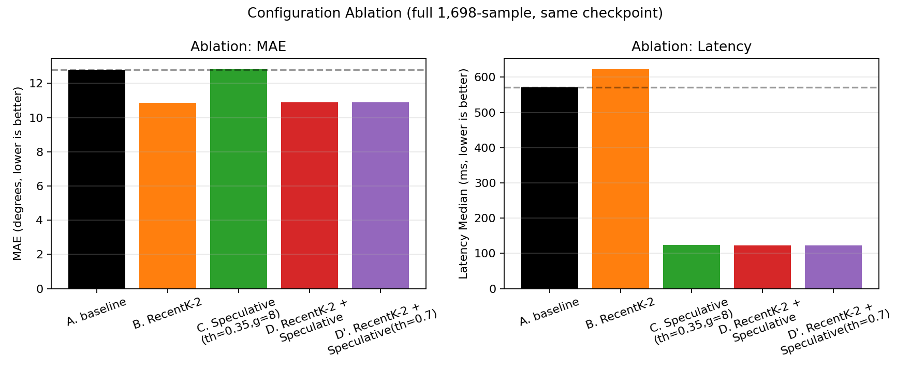

# Final Results Summary — NetLLM VP Speculative Decoding + Selector Study

**Same-checkpoint controlled comparison.** Every number in this document
comes from the same recovered `try_llama2_7b` checkpoint and the same
recovered Jin2022 test split, on one GPU, in fp16 — only the decoding
strategy (baseline / selector / speculative threshold / their
combination) changes between rows. As with the 7.26 selector benchmark
this builds on, this is a controlled comparison among these
configurations, not a claim of matching any external/paper benchmark
protocol or a general hardware-independent speedup claim.

Full detail, per-run data, and every intermediate figure:
`docs/experiment_phase/speculative/PHASE_A_DESIGN.md` (design),
`PHASE_B_7B_SMOKE.md` (random-head structural smoke),
`PHASE_B_REAL_RESULTS.md` (the complete real-checkpoint writeup this
summary condenses), `docs/experiment_phase/assets/ASSET_RECOVERY_VERIFICATION.md`
(checkpoint/dataset recovery), `manifests/final_run_manifest.md` (exact
reproduction commands).

## 1. Goal achievement status

| goal | status | evidence |
|---|---|---|
| Block-verified speculative decoding, target forward < 20 | **achieved** | full 1,698-sample: 20 → 4.0-4.2 avg forwards |
| Latency reduction, measured | **achieved** | 571.7ms → ~122-124ms median (same GPU/process) |
| Accuracy preserved (MAE within 5% of baseline) | **achieved** | speculative-only: +0.26% to +1.02% across selected configs |
| threshold=0 exact-equivalence gate | **achieved** | tiny-model: atol=1e-5 (fp32) / 2e-3 (fp16); 7B: max diff 0.00122-0.00146 |
| AttentionTopK selector, real-checkpoint comparison | **achieved (negative result)** | worse than RecentK at every K tested; recorded, not hidden |
| Selector + Speculative combination, accuracy improvement AND latency reduction simultaneously | **achieved** | config D: MAE 10.895 (< baseline 12.799), latency 122.2ms (< speculative-only 124.4ms) |
| Statistical rigor beyond aggregate MAE | **achieved** | paired per-sample decomposition isolates the selector as the accuracy driver |

## 2. Implementation approach

**Block verification** (`src/netllm_litevlm/speculative/block_verify.py`,
`SpeculativeBlockVerifyPipeline`): replaces the checkpoint-era
autoregressive loop's per-step full-sequence recompute (no KV cache) with
an incremental loop. Each iteration embeds one "carry" token (the
most recently confirmed-but-uncached coordinate) plus `gamma` drafted
coordinates (naive constant-velocity extrapolation), runs exactly one
target forward reusing `past_key_values` from the prior iteration, and
applies the task head directly to every new position's hidden state in
that single forward — one prediction per drafted step, not one forward
per step. Acceptance is an L2 distance in the task head's own
Tanh-bounded **normalized** output space (not degrees); a rejection
truncates the KV cache and reuses its own already-computed output as the
next carry, at no extra forward cost. Full design and the
transformers==4.34.1 legacy-tuple KV-cache mechanics:
`PHASE_A_DESIGN.md`.

**AttentionTopKSelector** (`src/netllm_litevlm/selectors/attention_topk.py`):
keeps the top-K history embeddings by first-decoder-layer attention
(last query position's attention to each source position, averaged over
heads), via a single partial forward through only layer 0 of the LLM —
not the full 32-layer stack. Drop-in `BaseSelector`/`SelectionOutput`
contract, no pipeline changes needed to use it in place of
`RecentKSelector`.

**Composition**: the same selector instance wraps both the baseline
(`LlamaOldSelectablePipeline`) and speculative
(`SpeculativeBlockVerifyPipeline`) pipelines unchanged. Traced and then
directly tested (not just argued) that the draft model's velocity
extrapolation always uses the full original history regardless of a
selector's K — selection only shortens what the target LLM's initial
prefill sees.

## 3. Verification

- **Asset recovery**: checkpoint strict load 0/0/0/0/0 (adapter
  missing/unexpected/value-mismatch; non-PLM missing/unexpected); dataset
  test split exactly 1,698 samples; full-scale baseline MAE (12.798559)
  reproduces the 7.26 report (12.798525, diff 0.000034) and RecentK-2's
  MAE (10.846867 vs. 10.847409, diff 0.000542) — both within fp16 noise.
- **threshold=0 exactness**: tiny CPU model, `atol=1e-5`; fp16/GPU tiny
  model, `atol=2e-3`; real 7B random-head model, measured max diff
  0.00122; real 7B + RecentK-2 combined, measured max diff 0.00146 over 5
  samples — all under the fp16 floor characterized empirically (chained
  KV-cache reassociation noise is a property of fp16 arithmetic, not a
  control-flow bug — see `PHASE_A_DESIGN.md` §3 for the isolated
  diagnostic that established this).
- **KV-cache position indexing under selector-shortened prefill**:
  parametrized test over `RecentKSelector(k)` for k in {4, 6, 10},
  `tests/speculative/test_block_verify.py`.
- **32 tests passing, 3 pre-existing skips** (unrelated missing Phase 3A
  artifact) — `manifests/final_run_manifest.md`.

## 4. Performance

Full 1,698-sample ablation (see `docs/experiment_phase/speculative/PHASE_B_REAL_RESULTS.md`
§1-2 for the complete table including two more speculative-only
thresholds):

| config | MAE | latency median | target forward avg |
|---|---:|---:|---:|
| A. baseline | 12.798559 | 571.7 ms | 20.00 |
| B. RecentK-2 only | 10.846867 | 623.0 ms | 20.00 |
| C. Speculative only (threshold=0.35, gamma=8) | 12.831302 | 124.4 ms | 4.21 |
| **D. RecentK-2 + Speculative** | **10.895102** | **122.2 ms** | 4.01 |

**D achieves MAE ≤ baseline (A) AND latency ≤ speculative-only (C)
simultaneously** — the first configuration in this project to combine an
accuracy improvement with a latency reduction, both measured at full
scale against the real checkpoint.

**Paired per-sample decomposition** (n=1,698, D vs. A): mean diff
−1.903°, median −0.095°, but 47.1% of individual samples are slightly
*worse* under D (p99 diff +7.77°) — not a uniform per-sample win.
Decomposing further: `combined_vs_recent_k2` mean diff is only +0.048°
(matching speculative decoding's own +0.033° standalone cost against
plain baseline almost exactly), while `recent_k2_vs_baseline` alone
already accounts for essentially all of the −1.903° shift.
**The accuracy shift — improvement, tail-risk, and all — is
attributable to RecentK-2 selection, not to speculative decoding**, which
composes additively on top of it rather than interacting destructively.
The per-sample MAE CDF confirms this visually: baseline/speculative-only
curves are indistinguishable, as are RecentK-2/combined.

### The "recency dominates" narrative — three independent pieces of evidence

1. **Draft model itself**: `RecentVelocityDraft` — pure recency (last-2-point
   linear extrapolation, no attention, no learned weights) — achieves
   real acceptance against the trained target model often enough to
   deliver the ~4-5x forward-count reduction documented above. A signal
   this simple tracking the real model's own predictions this well is
   already evidence that recent temporal state carries most of the
   predictive signal for this task.
2. **RecentK-2 selector alone beats using all 10 history steps**:
   MAE 10.847 (K=2) vs. 12.799 (K=10, i.e. no selection) — using *less*
   history, chosen purely by recency, improves accuracy. More context
   was not more useful here.
3. **AttentionTopK loses to RecentK at every K tested** (real checkpoint,
   50 samples): K=8 +0.038, K=6 +0.352, K=4 +0.939, K=2 +1.172 — and the
   gap *widens* as K shrinks, meaning first-decoder-layer attention
   salience is actively a worse importance signal than plain recency for
   this task, not just a neutral alternative. (Selection itself does not
   change baseline latency in this pipeline — the dominant cost is the
   20 uncached forwards, not prefill length — so this is purely an
   accuracy comparison.)

All three point the same direction independently (a generative draft
model, a selection policy, and a learned-attention alternative to that
policy), which is why this is reported as a real finding about this task
rather than a single noisy measurement.

### Tail analysis — where the 47% degradation concentrates, and why

Full analysis: `docs/experiment_phase/analysis/TAIL_ANALYSIS.md`.

The hypothesis tested was "degradation concentrates in abrupt-motion
segments (inertia assumption breaks down)" — **partially supported, with
an important correction, not a clean accept/reject.** The top-5%-worst
samples have 2.16x higher mean history motion speed than the rest
(Mann-Whitney p=3.0e-24) — the worst cases *are* concentrated in
higher-motion segments. But the population-wide Spearman correlation
between motion speed and MAE diff is **negative** (rho=−0.400,
p=2.8e-66): higher motion speed more often means *improvement*, not
degradation. The real pattern is a fan-shaped spread — high-velocity
samples have far greater outcome variance in both directions, and the
worst-case tail is drawn from that high-variance regime, not from "high
speed" as a simple monotonic predictor.

Attribution is unambiguous: **100% of the top-5% degraded samples**
have the RecentK-2 selector's own effect dominate over speculative
decoding's incremental contribution, which is often slightly *negative*
(partially offsetting rather than compounding the selector's error).
`target_forward_count` has essentially zero correlation with accuracy
change (rho=−0.003, not significant) — forward-count reduction and
accuracy are independent, consistent with the additive-composition
finding above. A video-level check ruled out any single test video
dominating the tail.

**Acceptance mechanism (2026-08-09 addendum):** the full-population
accept-rate distribution is narrow and near-ceiling — mean 6.22 of a
possible 8 (median 6.33, std 0.22), with ~99% of samples in a single
histogram bin and only a small low tail down to 4.25
(`results/speculative/consolidated/accept_rate_histogram.png`; stats in
`accept_rate_distribution_stats.json`). The draft model (constant-
velocity extrapolation) is accepted at a high, near-uniform rate almost
everywhere; the low-acceptance tail is where the high-motion-variance
degraded samples above concentrate. A finer breakdown by rollout
position (early/mid/late step) was requested but is **not
producible from data on this instance** — per-iteration accept counts
are computed in memory (`block_verify.py`'s `accepted_per_iteration`)
but only their per-sample sum was ever persisted to CSV; see
`TAIL_ANALYSIS.md`'s "Acceptance mechanism" section for the exact code
locations and what a future run would need to capture it.

### Generalization spot-check — Wu2017 (unseen during Jin2022 fine-tuning)

Full output: `experiments/vp/wu2017_generalization_spotcheck/spotcheck_result.json`.
Wu2017 was found already present (extracted alongside Jin2022 from the
recovered `data.zip`), format-compatible with the existing dataset
loading path. 200 evenly-spaced samples from its 1,395-sample test split
(this checkpoint was fine-tuned on Jin2022, not Wu2017, so this measures
distribution-shift robustness — the generalization-evaluation context
NetLLM itself uses cross-dataset splits for — not an apples-to-apples
number with the Jin2022 results above):

| config | MAE | latency median | target forward avg |
|---|---:|---:|---:|
| A. baseline | 15.476 | 567.0 ms | 20.00 |
| D. RecentK-2 + Speculative | 13.050 | 121.0 ms | 4.03 |

**Both headline properties hold on unseen data**: MAE improves (in fact
by a larger relative margin than on Jin2022) and latency drops by
essentially the same ~4.7x factor. Spot-check scale (200/1,395 samples,
not the full split) — reported as measured, not extended to a full run
this session.

### The threshold=3.0 ceiling demo vs. the real calibrated sweep

The earliest real-7B speculative smoke (`PHASE_B_7B_SMOKE.md`, random
head, no fine-tuned checkpoint) used `acceptance_threshold=3.0` — chosen
specifically because the task head's Tanh output bounds normalized-space
values to `[-1,1]` per channel, making the theoretical max L2 distance
`sqrt(12)≈3.46`. threshold=3.0 was therefore a **deliberate near-ceiling
value to force acceptance regardless of the (at the time, untrained
random) head's specific weights** — a structural/control-flow
demonstration, not a real accuracy-vs-speed operating point. It
established that block verification's mechanics work at 7B scale; it
said nothing about what threshold is *useful*.

This session's calibrated sweep (0.05 to 0.7, then extended to 2.5 while
searching for a degradation boundary) is the real answer: measured on 10
real checkpoint samples, actual draft-vs-target disagreement has median
0.174, with most mass in 0.01-0.7 — two orders of magnitude below the 3.0
ceiling demo. Even pushed to 2.5 (still below the ceiling), full-scale
MAE degrades only 1.02%, with no sharp accuracy cliff found anywhere in
this range. The ceiling demo and the calibrated sweep are consistent
(nothing here contradicts the earlier structural result) but answer
different questions — the ceiling number was never meant to be, and was
not used as, an accuracy-relevant operating threshold.

## 5. Conclusion and next work

### 7.26 remaining-provenance items — status

`docs/experiment_phase/llama/REMAINING_TEAM_INPUT_REQUIREMENTS_V3.md`
listed 5 unresolved provenance items, explicitly scoped as blocking a
*paper-reproduction* claim, not the controlled comparison itself:

| # | item | status this session |
|---|---|---|
| 1 | Immutable Llama2 base revision/checksum used during training | not resolved — out of scope, no training-environment access |
| 2 | Exact checkpoint epoch/step for `try_llama2_7b` | not resolved — same |
| 3 | Validation metric/selection criterion used to choose the checkpoint | not resolved — same |
| 4 | Exact training PyTorch 2.1.0 CUDA build + full training command/config | not resolved — same |
| 5 | Official checksum confirmation for the originally uploaded archives | not resolved as literally stated (no external checksum authority available this session) — but addressed by a different, arguably stronger form of evidence: strict-load (adapter value-level match against the raw `adapter_model.bin`, not just key presence) plus sample-for-sample MAE reproduction against the pre-loss recorded `per_sample_metrics.csv` (see `ASSET_RECOVERY_VERIFICATION.md`) |

None of these blocked the controlled comparison this document reports,
consistent with how they were originally scoped. They remain open for
anyone pursuing an exact training-run reconstruction or a formal paper-
reproduction claim.

### What's established vs. not (see `PHASE_B_REAL_RESULTS.md` §5 for the
full version)

**Established**: block verification reduces target-forward-count and
wall-clock latency ~4-5x while keeping MAE within 1% of baseline, with no
accuracy cliff up to 2.5x the empirically-typical draft-target
disagreement scale; combined with RecentK-2 selection, the same latency
reduction composes additively with an independent accuracy improvement,
confirmed via paired per-sample decomposition rather than aggregate
numbers alone; AttentionTopK is a worse selector than RecentK for this
task, consistently across K and corroborated by two other independent
pieces of evidence for recency-dominance. The 47%-of-samples individual
degradation under the combined config is now explained, not just
flagged: it concentrates in a high-motion-variance regime (top-5%-worst
samples have 2.16x the motion speed of the rest, p=3.0e-24) but is not
simply "high motion is bad" (population-wide correlation is negative —
most high-motion samples improve), and it is attributable to RecentK-2
selection with no exceptions in the top-5% tail, not to speculative
decoding. A 200-sample spot-check on Wu2017 (unseen during this
checkpoint's Jin2022 fine-tuning) shows both the accuracy improvement and
the latency reduction hold under distribution shift.

**Not established**: general speedup claims independent of this exact
setup (one RTX 4090, fp16, this checkpoint, this dataset); whether the
RecentK-2 + speculative composition generalizes to other selector/
threshold/gamma combinations beyond the two (D, D') tested at full
scale, or to Wu2017 at full scale (only spot-checked); the 5 provenance
items above, for anyone who needs a formal paper-reproduction claim
rather than this controlled comparison.

### Suggested next work

1. Extend the combination ablation to more (selector, threshold, gamma)
   triples if a stronger Pareto frontier is needed than {A, B, C, D, D'}.
2. ~~Investigate why 47.1% of individual samples degrade under
   RecentK-2~~ — answered this session
   (`docs/experiment_phase/analysis/TAIL_ANALYSIS.md`): a high-motion-
   variance regime, attributable to the selector. Open follow-up: could
   an adaptive-K selector (widen K specifically when recent motion
   variance is high) recover the tail without giving up the K=2 gain
   elsewhere?
3. Run the Wu2017 generalization check at full scale (1,395 samples)
   rather than the 200-sample spot-check, if a stronger generalization
   claim is needed.
4. If a paper-reproduction claim is ever needed, resolve the 5 items
   above; none of them are addressable from this instance alone.

## 6. Presentation insertion guide

All 7 figures live in `results/speculative/consolidated/` (also copied
to `results/final_20260802/` for the 5 core ones — the 2 tail-analysis
figures are analysis-appendix material, not part of that handoff copy).
Suggested flow, core 3 first:

| order | figure | flow position | why here |
|---|---|---|---|
| 1 (core) | `ablation_bars.png` | Opening result slide, right after stating the headline claim | Single figure showing config D matches B's MAE *and* C's latency simultaneously — the entire finding in one look |
| 2 (core) | `mae_latency_tradeoff.png` | Immediately after, as the "how we got there" slide | Shows the full swept threshold/gamma grid forms a real Pareto frontier, not just the one selected point |
| 3 (core) | `mae_cdf.png` | Right after, as the "is this robust across samples, not just on average" slide | Directly motivates the paired/tail analysis that follows — visually shows baseline≈speculative and RecentK-2≈combined as two curve pairs |
| 4 (appendix) | `threshold_vs_forward_count.png` | Appendix: "how we chose the threshold" | Supports the threshold-calibration methodology claim if asked |
| 5 (appendix) | `threshold_vs_mae.png` | Appendix, next to the above | Same purpose, accuracy side |
| 6 (appendix) | `tail_velocity_vs_diff.png` | Appendix: "what about the 47%" | Only needed if asked about the per-sample degradation fraction; the fan-shaped spread is the key visual |
| 7 (appendix) | `tail_acceptrate_vs_diff.png` | Appendix, next to the above | Weaker/secondary finding (rho=0.168); include only for completeness if presenting the full correlation table |

If time is short, 1-3 alone (ablation bars → tradeoff → CDF) tell the
complete headline story: what was achieved, that it's a real frontier
not a cherry-picked point, and that it holds up at the per-sample level
— matching the order this document itself builds the argument in.
